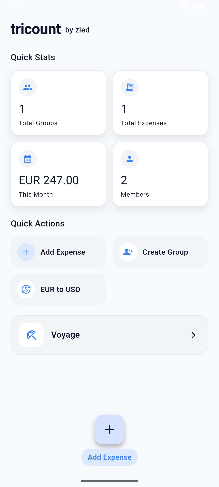
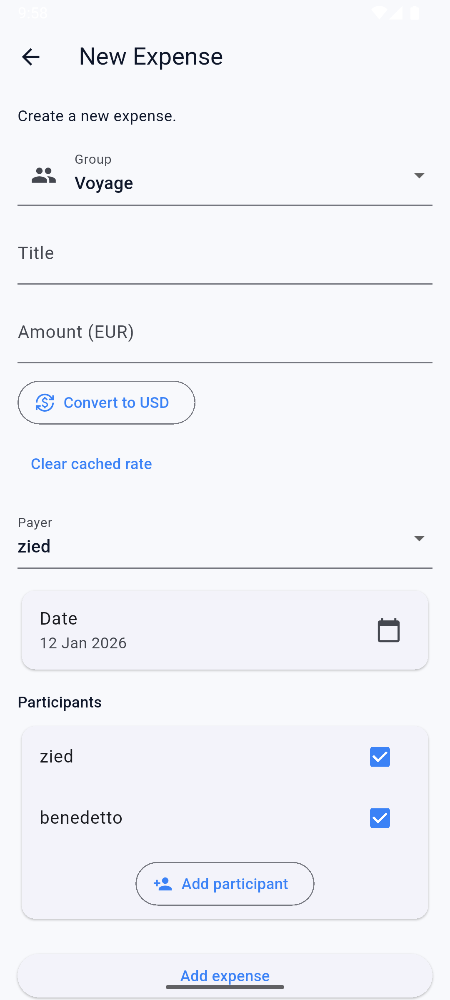
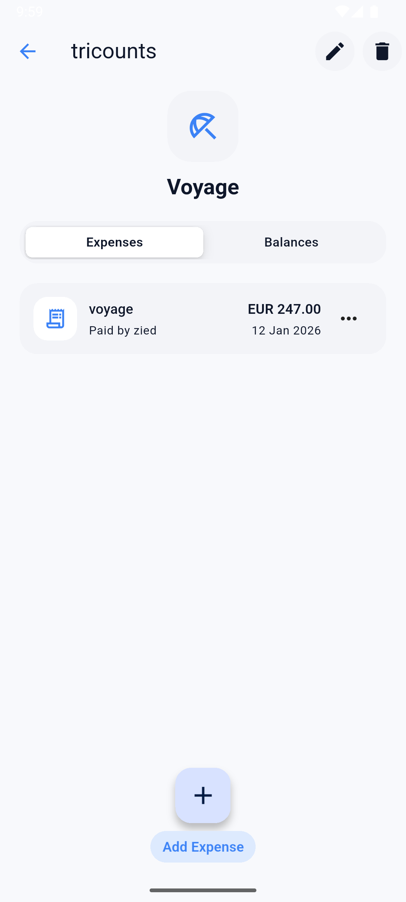
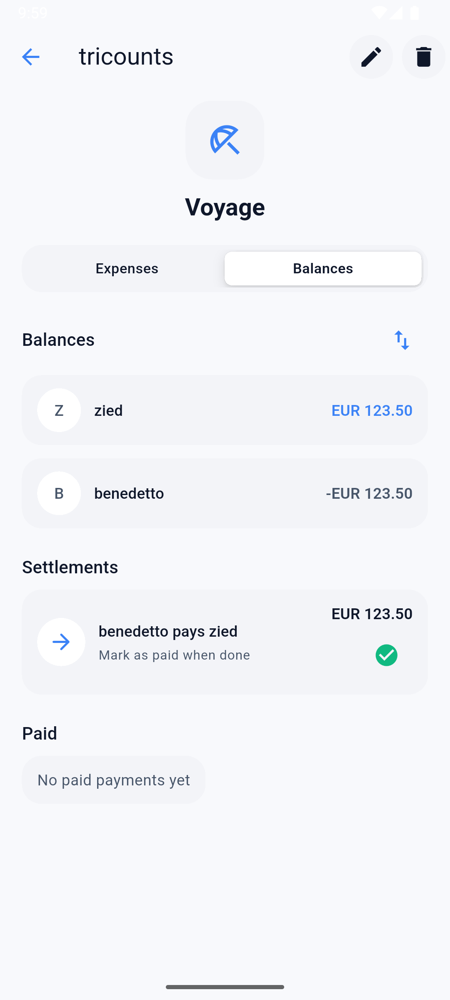
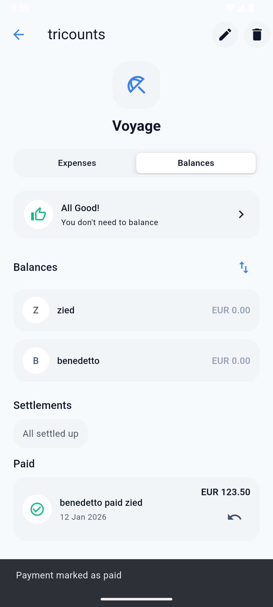

# Tricount

## A. Author
**Name:** Zied Bousnina
**Matricola:** 344807

## B. Project
A simple expense sharing app built with Flutter, similar to the Tricount app.

## C. Overview
This app helps you split expenses with friends or roommates. You can create groups, add expenses, and see who owes who. The app calculates balances automatically and suggests the easiest way to settle debts. It also converts EUR to USD using live exchange rates.

**Features:**
- Create groups and add members
- Track expenses with payer and participants
- Automatic balance calculations
- EUR to USD conversion
- Local data storage (works offline)

## D. How It Works
You start by tapping "Add Expense" to create your first expense. Enter the amount, pick who paid and who participated, add a description. That's it. The app figures out the balances.

To see who owes what, tap on any group card. You'll see all expenses and a balance summary showing payment suggestions.

For currency conversion, tap "EUR to USD" in the quick actions. The rate gets cached so you don't need internet every time.

**Screenshots:**

   

## E. Technical Stuff

**Main packages:**
- **Provider** - for state management, keeps the UI synced when data changes
- **Hive** - local database, stores everything on your device
- **http** - fetches exchange rates from an API

**Implementation choices:**
I used the repository pattern to separate data logic from UI. Each data type (groups, expenses, payments) has its own repository and provider. This made the code easier to manage.

For the UI, I went with Material 3

**Problems I ran into:**
The trickiest part was keeping all screens updated when you change something. Solved it with `ChangeNotifierProxyProvider` which automatically updates related data. For example, when you select a group, expenses get filtered automatically.

Exchange rates were another issue - needed them to work offline. So I cache the rate locally after fetching it once.

---

Run with: `flutter pub get` then `flutter run`

